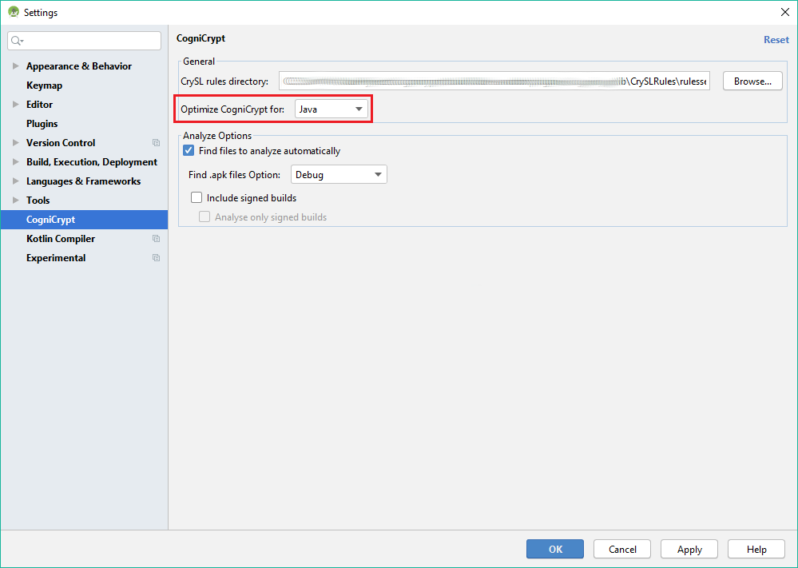

# Supported Programing Languages
Since CogniCrypt analyzes Java Bytecode, the Plugin in principal supports any [JVM compatible Languages](https://en.wikipedia.org/wiki/List_of_JVM_languages), such as **Java**, **Kotlin**, **Scala** or **Clojure**. 

So far **Java** and **Kotlin** have been successfully tested with this Plugin. 

## Language Optimizations

As soon as the CogniCrypt Analysis finds a Crypt-API misuse, the Crypt-API misuse is shown in the [CogniCrypt Window](ToolWindow.md) and in the designated source file. Therefore, a mapping between the internal finding's representation and an existing source file must be created. As all JVM languages use different source file extensions *(e.g.: .java, .kt)* the Plugin tries to find any of these registered file extensions. To reduce unnecessary I/O on your system, the Plugin gives you an option to set your preferred language. The Plugin will then favor that language. 

If you want to change the ruleset please follow the next steps:  

1. In the Settings/Preferences dialog *(Ctrl+Alt+S)*, select **CogniCrypt**.
2. Choose your main language from the combobox.
3. Click **OK** in the dialog to save your selection.

*Note: The tool still works on all other languages, thus making this setting optional*

