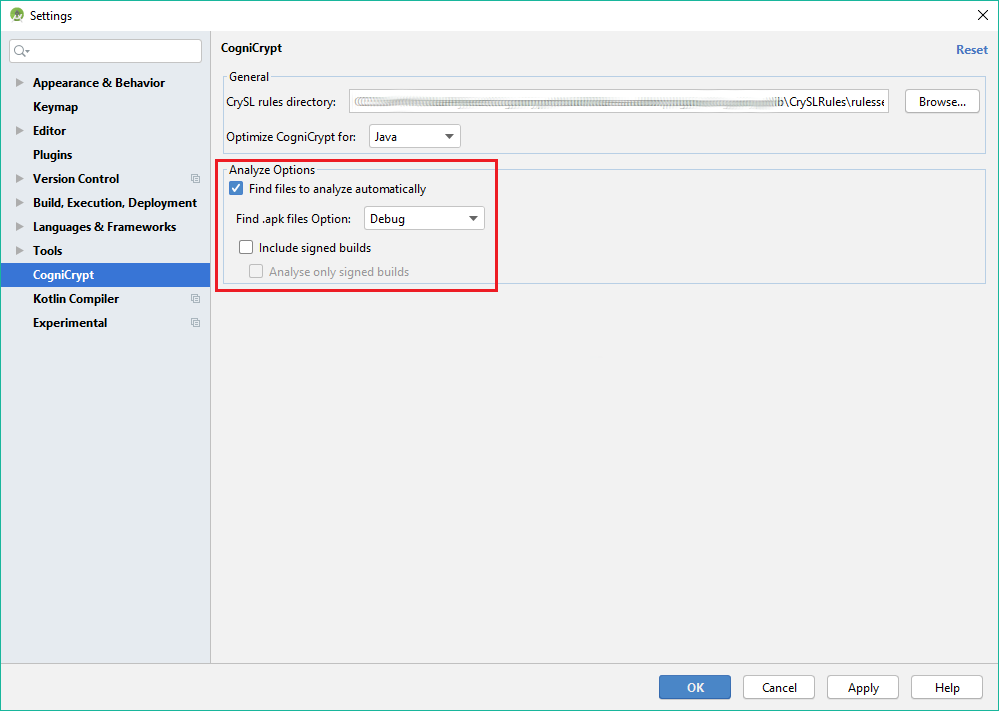

# Analyze Options
As stated in [CogniCrypt Analysis](AnalysisInfo.md) IntelliJ and Android Studio require different inputs *(.class or .apk files)* to perform the analysis. Also the necessary input files can reside on different storage locations. Basically the user gets the options to let the plugin decide which files it ought to analyze or to choose them manually. 

The automatic input search is bound to a few conditions which the user can configure. By default the plugin searches for all applicable input files that are built with the compilers **DEBUG** configuration.

Otherwise you can define to automatically search for **RELEASE** builds or any of **DEBUG** and **RELEASE**.

Additionally you can include signed builds or only use signed builds.  
**TODO: Decide if this is an exclusive Android Studio Feature**.

You find these settings under:  

1. In the Settings/Preferences dialog *(Ctrl+Alt+S)*, select **CogniCrypt**.
2. Choose your tool's behavior from the settings from inside the red border. 
3. Click **OK** in the dialog to save your selection.

