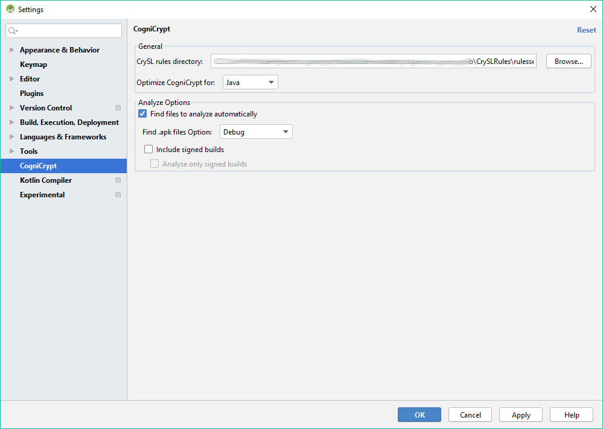

## What is CrySL
CogniCrypt performs its Analysis based on a ruleset that defines by a white list approach how certain API calls must be invoked to consider them secure. 

CrySL is is a markup language that defines those rules. It's formal specification can be read [here](https://www.eclipse.org/cognicrypt/documentation/crysl/). For each Crypto-API, such as the JCA or BouncyCastle, a custom ruleset must be used. This is because each of these APIs have different designs and patterns to use the cryptographic features. 

## CrySL in IntelliJ IDEs

CogniCrypt for IntelliJ-based IDEs comes with the JCA ruleset. No additional setup is required. This ruleset, as well as the BouncyCastle and Tink ruleset can be downloaded from [GitHub here](https://github.com/CROSSINGTUD/CryptoAnalysis/releases/download/2.3/CrySL-rulesets.zip). 

If you want to change the ruleset please follow the next steps:

1. In the Settings/Preferences dialog *(Ctrl+Alt+S)*, select **CogniCrypt**.
2. Press the **Broswe...** button and navigate to the root directory of a CrySL ruleset.  
*(Such a root directory contains .cryptslbin files)*
3. Click **OK** in the dialog to save your selection.

## Supported Rulesets
So far this release of CogniCrypt only comes with the **JCA ruleset**. Other rulesets are supported but not yet included.