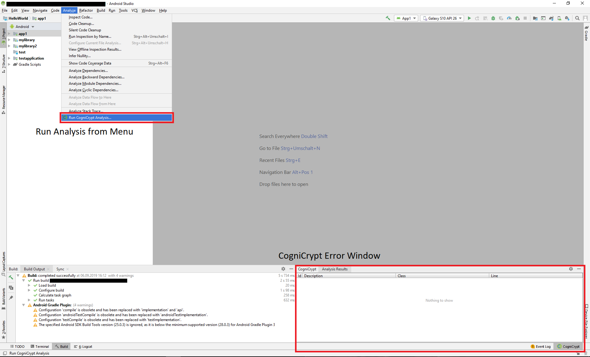

# Using CogniCrypt for IntelliJ IDEs

## Software Requirements

- Any **Windows**, **macOS** or **Linux** Operating System
- ca. **30MB** of Storage Space

### Supported IDEs
- **IntelliJ Community Edition 2019.2**
- **IntelliJ Community Edition 2019.3**
- **IntelliJ Ultimate 2019.2**
- **IntelliJ Ultimate 2019.3**
- **Android Studio** (v3.5 or greater)

### Supported Programming Languages
- **Java**
- **Kotlin**

*All languages are supported for Applications and Android Apps*

## General Overview

Below you can see an image how the IDE, in this case Android Studio, will look like when CogniCrypt was installed.

First thing you notice is the new tool window created in the bottom right corner. Findings found by the analysis will be reported here. More information about the CogniCrypt Window can be found [here](ToolWindow.md).

## Running an Analysis

### **Prerequisite**
CogniCrypt is a static code analysis tool, that inspects the Java-Bytecode produced from the source code by the compiler. Thus before running a code analysis you **must build your code first**.

### **Analysis**
To run an analysis you need to invoke the menu item shown in the image above. More details about how the analysis works and how you can configure it can be read [here](AnalysisInfo.md).

## Other Features
- [CogniCrypt Rulesets](CrySLRules.md)
- [Analysis Behavior Options](AnalysisBehaviorSettings.md)
- [Analysis Targeting Options](AnalysisTargetSettings.md)

## Limitations

- Analysis on obfuscated code may not succeed. [Read more](ObfuscatedCode.md). 
- A Error-to-Code line mapping only is sufficient if all source files have not been modified since the last compilation (including line breaks)  
- Package Private classes that reside inside a other class file can not be resolved as no mapping between source code file and full qualified class name is possible.

## Known Bugs
- Error line markers might not get rendered until the file in question was modified nearby the line containing the error.